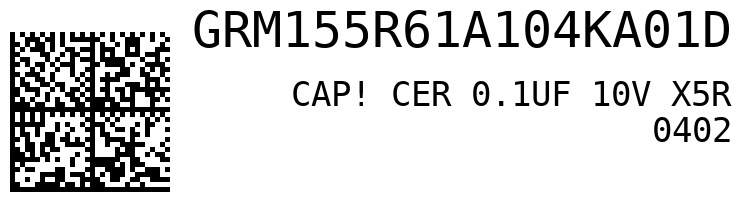

# Inventory Label Generator

Quick script to generate labels with DataMatrix 2d barcode, part name, and part description for my home lab inventory system.



## Installation
### Create and activate virtualenv
```
virtualenv venv
source venv/bin/activate
```

### Install libdmtx
Linux:
```
sudo apt-get install libdmtx0a
```

MacOS:
```
brew install libdmtx
```

### Install python dependencies
```
pip install -r requirements.txt
```

## Example:
```
python inventory_label.py GRM155R61A104KA01D "CAP CER 0.1UF 10V X5R 0402" "[)>\x1e06\x1dP490-1318-1-ND\x1d1PGRM155R61A104KA01D\x04" --outfile label.png
```

(Use --debug to view preview image)
